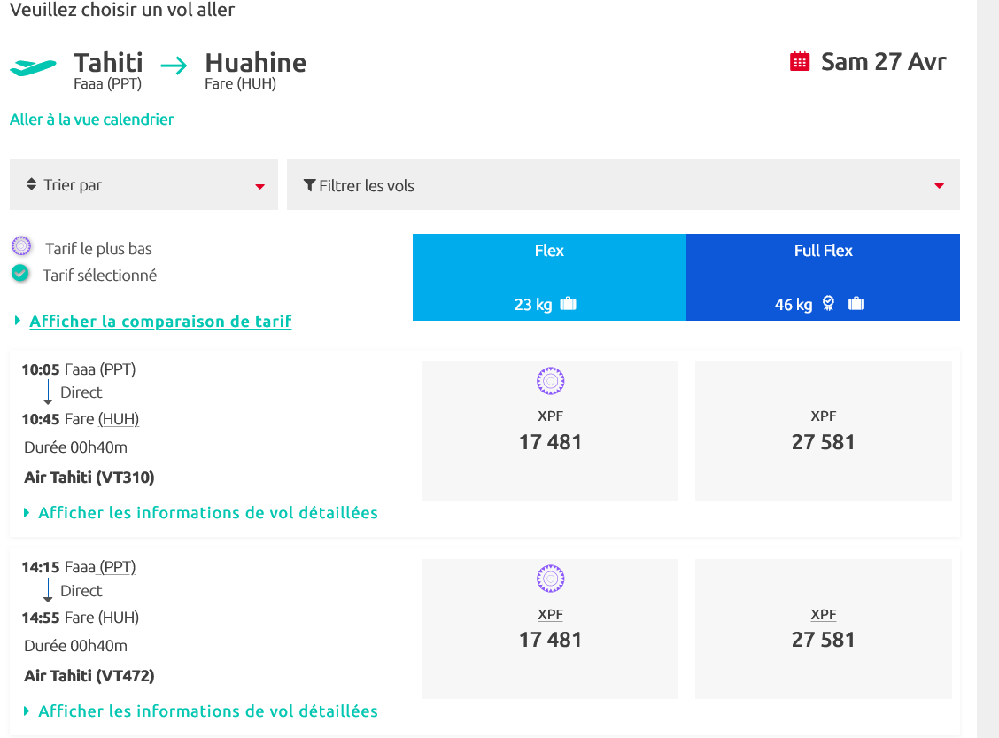
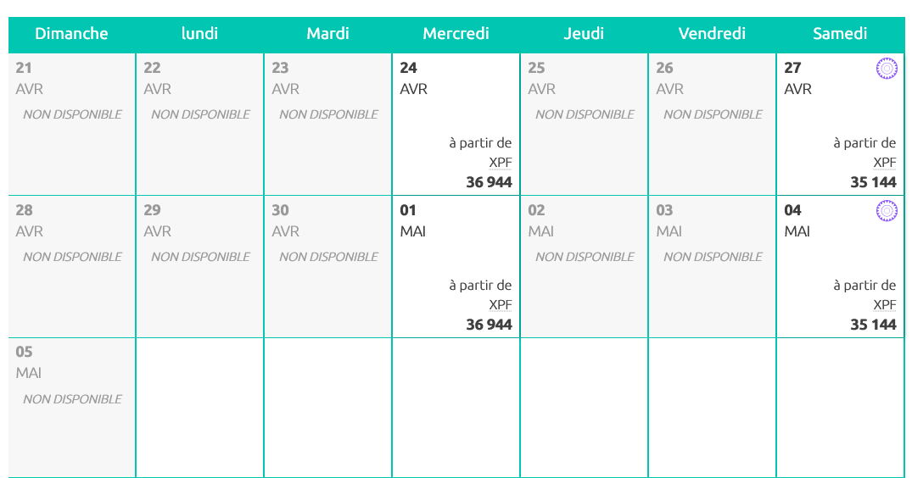
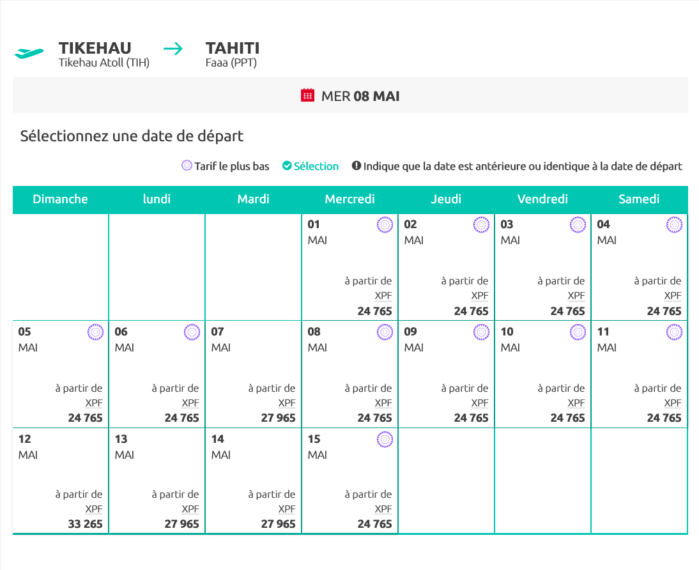

# Voyage en Polynésie

## Jour 0: Le trajet allée

Long périple depuis Nice... plus de 24h de trajet, avec stop à Paris, Los Angeles et enfin Tahiti

## Jour 1: Arrivée à Faa'a (21/04/2024)

Notre vol arrive tôt... 5h30   
On loue un véhicule chez [Eco-Car](https://www.ecocar-tahiti.com/)   
Le transport: Voiture loc
L'hébergement:   
Les activités: Marché de Papeete (le dimanche matin avant 9h)
Les dépenses:   

## Jour 2: Tahiti - (22/04/2024)

Découverte de l'ile ITI et NUI
Le transport: Voiture 
L'hébergement:   
Les activités: Surf à Teahupoo, Mont Aorai
Les dépenses:   

## Jour 3: Tahiti - (23/04/2024)

Découverte de l'ile ITI et NUI
Le transport: Voiture 
L'hébergement:   
Les activités:   
Les dépenses:   

## Jour 4: Moorea (24/04/2024)

Visite ile
Le transport: Bateau 
L'hébergement:   
Les activités:   
Les dépenses:   

## Jour 5: Moorea (25/24/2024)
Le transport: 
L'hébergement:   
Les activités:   
Les dépenses:   

## Jour 6: Moorea (26/04/2024)

Le transport: 
L'hébergement:   
Les activités:   
Les dépenses:   

## Jour 7: Huahine (27/04/2024)

Depart de Moorea vers Huahine via Papeete (depart 10h05)
Arrivée Huahine à 10h45

Le transport:  Voiture + Bateau + Avion - 
L'hébergement:   
Les activités:   
Les dépenses:   

## Jour 8: Huahine (28/04/204)
Le transport: 
L'hébergement:   
Les activités:   
Les dépenses:   

## Jour 9: Huahine (29/04/2024)

Le transport: 
L'hébergement:   
Les activités:   
Les dépenses:   

## Jour 10: Raiatea (30/04/2024)

Avion depart 7h40, arrivée 8h00

Le transport: 
L'hébergement:   
Les activités:   
Les dépenses:   

## Jour 11: Raiatea (01/05/2024)

Le transport: 
L'hébergement:   
Les activités:   
Les dépenses:   

## Jour 12: Raiatea Bora Bora (02/05/2024)

Journéee sur RAIATEA puis soirée 
Avion depart à 17h50 arrivée à 18h10 à BOB
Le transport: 
L'hébergement: BOB   
Les activités:   
Les dépenses:   

## Jour 13: Bora Bora (03/05/2024)

Le transport: 
L'hébergement: BOB   
Les activités:   
Les dépenses:   

## Jour 14: Bora Bora / Tikehau (04/05/2024)

Depart de BOB à 10h45 Arrivée à TIH 12h50
Le transport: 
L'hébergement:   
Les activités:   
Les dépenses:   

## Jour 15: Tikehau (05/05/2024)
Le transport: 
L'hébergement:   
Les activités:   
Les dépenses:   

## Jour 16: Tikehau (06/05/2024)
Le transport: 
L'hébergement:   
Les activités:   
Les dépenses:   

## Jour 17: Tikehau (07/05/2024)

Le transport: 
L'hébergement:   
Les activités:   
Les dépenses:   

## Jour 18: Tikehau Tahiti (08/05/2024)

Vol de TIH à PPT
Le transport: 
L'hébergement:   
Les activités:   
Les dépenses:   

## Jour 19: Tahiti (09/05/2024)

Cadeau au marché
Le transport: 
L'hébergement:   
Les activités:   
Les dépenses:   

## Jour 20: FIN (10/05/2024)

Retour en France, départ à 7h30
Le transport: 
L'hébergement:   
Les activités:   
Les dépenses:   

Vol Bora Bora vers Tikehau   

Vol Tikehau vers Tahiti
