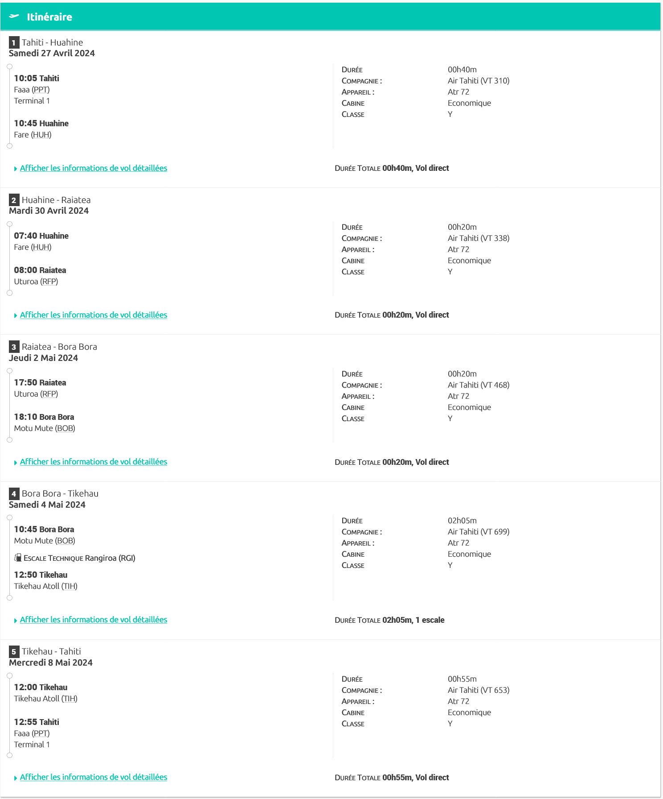

# Voyage en Polynésie

## Notre plan de Vol avec Air Tahiti et un 'Pass Bora Tuamotu Light'

   

Tarif: 205 200 XPF ( ~ 1 720 €) pour 2 adultes et un enfant de 8 ans

## Jour 0: Le trajet allée

Départ samedi 20 avril 2024 à 14h35 à Nice Terminal 2 - Vol effectué par AMELIA INTERNATIONAL, AF7307 (A320) 1h35 de vol   
Arrivée à Paris CDG à 16h10  (3h15 de correspondance)   
Départ Paris CDG à 19h25 - AF026 Airbus A350-900 - 22h05 de vol avec 2h25 d'escale à Los Angeles   
Arrivée à 5h30 le 21 avril 2024 (17h30 en Métropole)

## Jour 1: Arrivée à Faa'a (21/04/2024)

Location véhicule chez [Eco-Car](https://www.ecocar-tahiti.com/)  - 6 jours pour 264 €   
**Le transport**: Voiture loc récupération à l'agence à 7h30 - L’agence ecocar se situe en face de l’aéroport de tahiti, coté montagne, à environ 200 mètres et 2 minutes à pied.   
Les véhicules sont assurés dans les mêmes conditions pour circuler sur l`ile de moorea. les conditions d’assistance sont différentes de tahiti, compte tenu de la distance et de l`absence de service d`intervention à moorea.   
Pour la restitution du véhicule, faire le plein dans une station de moins de 10 km de l'agence le jour même (ticket du plein à présenter) 
ALLER RECUPERER LES BILLETS BATEAU POUR MOOREA : traversée Tahiti-Moorea le 24 avril matin / retour Moorea- Tahiti le 27 avril 2024 première heure car vol à 10h05 pour Huahine
**L'hébergement**: U'upa Lodge - Alexis LEGER ( What's app + 689 89 57 48 27 ) 10 000 xpf/nuit + 4 000 xpf Ménage   
**Les dépenses**:   Auto = 264 €  Réglé   
                    Hébergement 34.000 xpf (10.000 x 3 nuits + 4000 ménage) - Acompte versé 17.000xpf (143€) - **Reste à payer 17.000 xpf**

## Jour 2: Tahiti - (22/04/2024)

**Le transport**: Voiture    
**L'hébergement**: U'upa Lodge   

## Jour 3: Tahiti - (23/04/2024)

**Le transport**: Voiture   
**L'hébergement**: U'upa Lodge    

## Jour 4: Moorea (24/04/2024)

**Le transport**: Bateau + Voiture  
**L'hébergement**: SUNSETVIEW à Haapiti - Yves et Marie FAGON (Téléphone +689 87 79 84 04) Booking 364 € [BOOKING](https://www.booking.com/hotel/pf/sunset-view-studio-private-beach-amazing-swim.fr.html)   
**Les dépenses**:   bateau A/R ~ 15.000 xpf (125€) à acheter le 21 avril  
                    + Hébergement 364 € virment fait le 04/04/2024  

## Jour 5: Moorea (25/24/2024)
**Le transport**: voiture 
**L'hébergement**:SUNSETVIEW à Haapiti    

## Jour 6: Moorea (26/04/2024)

**Le transport**: voiture   
**L'hébergement**:SUNSETVIEW à Haapiti    

## Jour 7: Huahine (27/04/2024)

Depart de Moorea vers Huahine via Papeete (depart 10h05) vol VT310
Arrivée Huahine à 10h45
Logement Chez Guynette pension à Fare - chezguynettehuahine@gmail.com -téléphone : + (689) 40 68 83 75- 7.500 xpf (63 €)  pour 3 personnes / nuit.  

**Le transport**:  Voiture + Bateau + Vol VT310 -    
**L'hébergement**: Chez Guynette    
**Les dépenses**: Hébergement 22.500 € (189€) pour 3 nuits - Acompte de 7.500 xpf - **Reste à payer 15.000 xcp**  

## Jour 8: Huahine (28/04/204)

**Le transport**:  ?
**L'hébergement**: chez Guynette   

## Jour 9: Huahine (29/04/2024)

**Le transport**:  ?  
**L'hébergement**: Chez Guynette  

## Jour 10: Raiatea (30/04/2024)

Avion depart 7h40, arrivée 8h00 à Raiatea - Vol VT338
Logement apprt à Uturoa - +68987286933  - via Booking - 26.732 xpf (225 €) pour 2 nuits - ohanalocation@gmail.com -
Location voiture avec logement - 5.000 xpf (42 €) par jour soit 15.000 xpf pour 3 jours- Transferts aeroport compris

**Le transport**: Vol VT338 + voiture  
**L'hébergement**: Ohana Location à Uturoa      
**Les dépenses**: Hébergement 26.732 xpf + Loc voiture 15.000 xpf = 41.732 xpf - Virement fait le 04/04/2024   

## Jour 11: Raiatea (01/05/2024)

**Le transport**: voiture   
**L'hébergement**: Ohana Location à Uturoa     

## Jour 12: Raiatea Bora Bora (02/05/2024)

Journée sur RAIATEA puis soirée    
Avion depart à 17h50 arrivée à 18h10 à BOB puis navette gratuite de 20 min direction VAITAPE. Voiture avec hotesse qui nous attendra pour nous mener au logement (Tél. + 689 87 79 26 48 ou 89 50 21 72)
Logement Sunset Hill Lodge BP 58 Vaitape à Bora Bora - Appart Moana 3 - tarif : 43 854 xpf (367,50 €) pour 2 nuits - tèl : +689 87792648 - sunset.hill.lodge@mail.pf - Payé CB le 21/01 - numéro de confirmation : 3727738638803.
Wi-Fi pwd: villamoana57

**Le transport**:  voiture + Vol VT468   
**L'hébergement**: Moana3 Sunset Hill Lodge   
**Les dépenses**: Hébergement 43 854 xpf (367,50 €) pour 2 nuits  

## Jour 13: Bora Bora (03/05/2024)

**Le transport**: ?   
**L'hébergement**: Moana3 Sunset Hill Lodge 

## Jour 14: Bora Bora / Tikehau (04/05/2024)
Hotesse qui nous dépose à la navette
Depart de BOB à 10h45 Arrivée à TIH 12h50 (Escale Technique Rangiroa) - Récupération à l'aeroport -
Logement TIKEHAU vaikihei one - leetahiariki@mail.pf - What's app +68 98 773 53 14 - 48.000 xpf (400€) 12.000xpf par nuit - Payé le 09 janvier 2024.  
Pret de vélo
**Le transport**: Vol VT699   
**L'hébergement**: Chez Tahiariki - TIKEHAU vaikihei one   
**Les dépenses**: 48.000 xpf (400€) pour 4 nuits    

## Jour 15: Tikehau (05/05/2024)

**Le transport**: ?   
**L'hébergement**: Chez Tahiariki - TIKEHAU vaikihei one    

## Jour 16: Tikehau (06/05/2024)

**Le transport**: ?  
**L'hébergement**: Chez Tahiariki - TIKEHAU vaikihei one 

## Jour 17: Tikehau (07/05/2024)

**Le transport**: ?  
**L'hébergement**: Chez Tahiariki - TIKEHAU vaikihei one   

## Jour 18: Tikehau Tahiti (08/05/2024)

Vol de TIH à 12h00 à PPT à 12h55
On vient nous cherher à l'aéroport (faire message à l'hote)  
Logement pour 2 nuits au MANAEVA L6 - Cité de l'air FAAA Quartier PATAHUE - tèl : +689 87 29 19 58 (reservation booking annulable jusqu'au 6 mai) - Tarif 27.900 xpf (235€) - **Reste à régler 27.900 xpf**
**Le transport**: Vol VT653   
**L'hébergement**: MANAEVA L6     

## Jour 19: Tahiti (09/05/2024)
  
**Le transport**: ?  
**L'hébergement**:  MANAEVA L6  

## Jour 20: FIN (10/05/2024)

Retour en France, départ à 7h40 - FAAA - AF027 (Airbus A350-900) 21h05 de vol avec 2h15 d'escale à LOS ANGELES
Arrivée à 16h45 le samedi 11/05/2024 à PARIS CDG   
correspondance 4h50   
Départ PARIS CDG à 21h35 - AF7314 (Airbus A321) 1h30 de vol   
Arrivée à Nice à 23h05  
